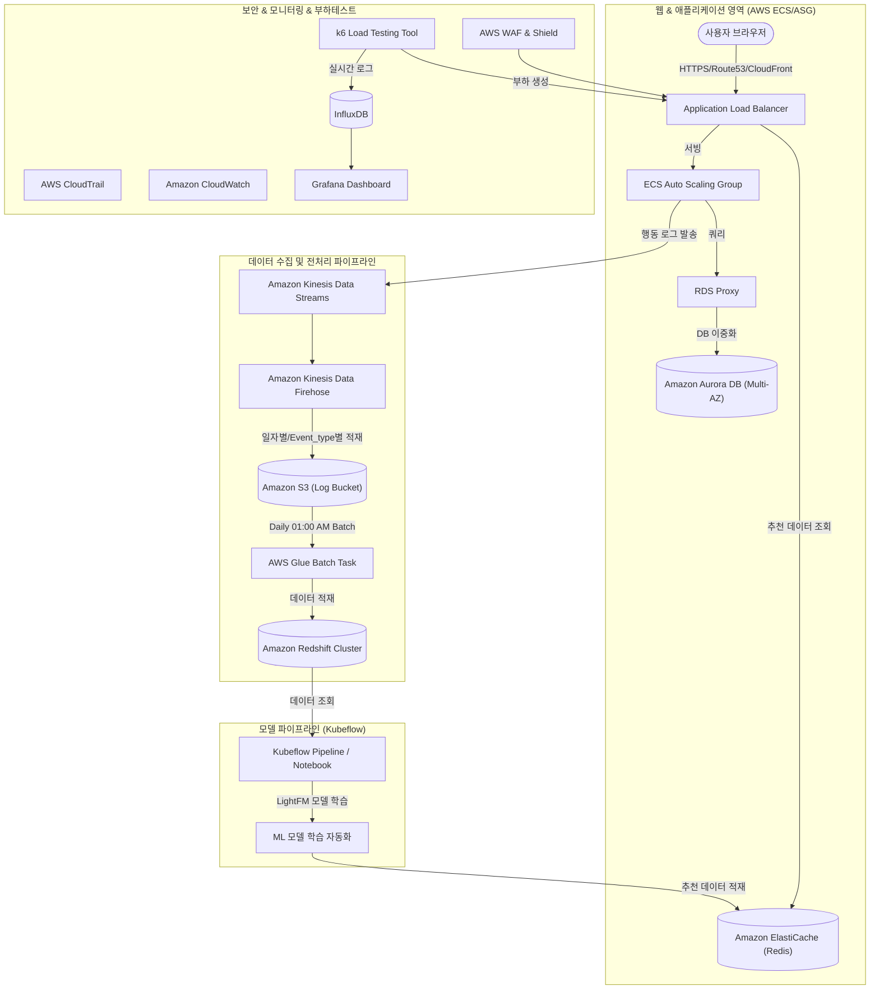

# 새싹 방범대 (Saessak Crime Prevention)
> **E-commerce 코스매틱 상품 개인화 추천 시스템 인프라 구축 프로젝트**

본 프로젝트는 E-commerce 코스매틱 쇼핑몰을 대상으로 실시간 사용자 행동 로그를 수집·변환하고, 머신러닝 기반의 개인화 추천 모델을 활용해 맞춤형 상품 추천 서비스를 제공하는 AWS 기반 데이터 및 모델 파이프라인 인프라 구축 프로젝트입니다.

---

## 1. 비즈니스 배경 & 설계 기준 (Notion 기반)
본 프로젝트는 국내 최대 E-commerce 서비스인 **쿠팡**의 규모를 페르소나 기준으로 삼아 인프라 부하 및 처리량을 산정하였습니다.

### 1-1. 피크 타임 트래픽 예측 모델
* **기준 회원 수**: 1,400만 명
* **일일 활성 사용자 수 (DAU)**: 회원 수의 20%인 **280만 DAU**
* **피크 타임 동시 접속자 수**: DAU의 10%인 **28만 명**
* **요청 처리량 (HTTP Requests)**: 사용자 1명이 평균 10회 요청한다고 가정할 때, 피크 타임 기준 **초당 약 280만 요청 (280만 TPS)**을 소화하는 웹 및 데이터 수집 인프라를 목표로 설계되었습니다.

### 1-2. 비즈니스적 목표 & 측정 지표
* **매출 영향도 파악**: 노출된 추천 상품이 실제 구매로 이어지는지 추적하여 비즈니스 가치를 입증합니다.
* **지표값 관리**:
  - 추천 상품 노출 대비 클릭 비율 (CTR: Click-Through Rate)
  - 추천 상품 노출 대비 최종 구매 전환율 (CVR: Conversion Rate)
  - 추천 상품을 통한 고객당 평균 구매 가격 (AOV: Average Order Value)
* **평점 필터링 규칙**: 머신러닝 학습 품질 확보를 위해 사용자가 부여한 평점 중 **4점 이상인 평점 데이터만 추천 모델 학습에 반영**하도록 파이프라인을 설계했습니다.

---

## 2. 시스템 아키텍처
데이터 수집부터 전처리, ML 학습, 캐시 적재 및 서빙이 유기적으로 연결된 실시간 인프라 구조입니다.



---

## 3. 로그 데이터 규격 (Dataflow)
애플리케이션 영역에서 Kinesis Data Streams로 전달하는 사용자 행동 로그의 기본 규격 및 JSON 양식입니다.

### 3-1. 공통 로그 규격
```json
{
  "timestamp" : "2024-12-18T14:05:32+09:00",
  "user_id" : "user_a1",
  "event_type" : "product_click",
  "product_id" : "prod_0001",
  "product_name" : "달바 퍼스트 스프레이 세럼 100ml",
  "page" : "main",
  "rec_prod_list" : [ "prod0001", "prod0002", "prod0003", "prod0004", "prod0005" ],
  "rating" : 4,
  "pur_list" : [ "prod0002", "prod0005" ],
  "pur_amount" : 15000
}
```

### 3-2. 이벤트 유형별(Event Type) 필드 상세
1. **`product_click`** (메인/카테고리 상품 클릭): 사용자가 상품 목록에서 상세 페이지로 이동할 때 발생.
2. **`login`** (로그인 성공): 사용자 인증 시 발생.
3. **`to_cart`** (장바구니 담기): 상세 페이지에서 장바구니 버튼 클릭 시 발생.
4. **`rec_click`** (추천 상품 클릭): 상세 페이지 하단 추천 영역 상품 클릭 시 발생.
5. **`purchase`** (구매 완료): 장바구니 내 전체 상품 결제 완료 시 발생.
6. **`review_rating`** (평점 등록): 구매 후 평점을 남길 때 발생 (1회 제한).

---

## 4. 데이터셋 정의

### 4-1. 상품 마스터 테이블 (1,682종 화장품)
* **ID 예시**: `prod0001` ~ `prod1682`
* **속성**: 상품명, 카테고리(스킨케어, 메이크업 등), 가격

### 4-2. 사용자 테이블 (943명)
* **ID 예시**: `user0001` ~ `user0943`
* **속성**: 사용자 이름, 가입일자

---

## 5. 상세 기술 백서 (docs/)
프로젝트 인프라 및 파이프라인의 핵심은 아래 문서를 통해 상세 정보를 파악할 수 있습니다.
* [1. 시스템 아키텍처 기술서 (docs/architecture.md)](docs/architecture.md)
* [2. 데브옵스 트러블슈팅 가이드 (docs/troubleshooting.md)](docs/troubleshooting.md)
* [3. OSS 설치 및 플랫폼 환경 구축 가이드 (docs/install_oss.md)](docs/install_oss.md)

---

## 6. 오픈소스 설치 및 검증 자동화 스크립트 (scripts/)
프로젝트 로컬 빌드 및 EKS Kubeflow 환경 구동을 돕는 자동화 스크립트 구성은 다음과 같습니다.
* **로컬 컴파일러 및 의존 패키지 구성**: [scripts/install_local_deps.sh](scripts/install_local_deps.sh) (Mac/Linux 환경 대응)
* **Kubeflow Manifests EKS 설치 자동화**: [scripts/install_kubeflow_manifests.sh](scripts/install_kubeflow_manifests.sh) (Kustomize v5.0.3 매핑)
* **로컬 DB/Cache 모의 컨테이너**: [scripts/docker-compose-local.yml](scripts/docker-compose-local.yml) (Redis & PostgreSQL)
* **모의 파이프라인 종단간(E2E) 로컬 검증**: [scripts/test_local_pipeline.py](scripts/test_local_pipeline.py) (DB Seeding $\rightarrow$ Train $\rightarrow$ Redis Sync)

